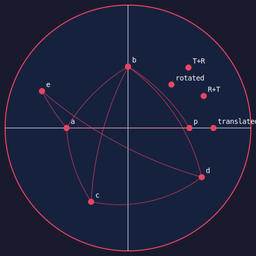

# Mobius

A Möbius transformation explorer on the Poincaré disk, implemented in Rust.
Built as a stepping stone toward Pilar — and because the math is beautiful.

## What are Möbius Transformations?

Möbius transformations are the isometries of hyperbolic space — the distance-preserving
"moves" you can make on the Poincaré disk. In Euclidean space you can rotate and translate
without distorting geometry. Möbius transforms are the hyperbolic equivalent.

The general form is:

`f(z) = (az + b) / (cz + d)`

where z, a, b, c, d are complex numbers. Every transformation that preserves the Poincaré
disk — every rotation, every translation in hyperbolic space — is a special case of this formula.

## What's Implemented

- **Disk isometry** — translates the origin to any point w, preserving hyperbolic distances
- **Rotation** — rotates the disk by angle θ via multiplication by e^(iθ)  
- **Composition** — transforms can be composed; order matters (they don't commute)
- **General Möbius** — the unified form showing isometry and rotation as special cases
- **Geodesics** — shortest paths between points in hyperbolic space, rendered as circular arcs
- **SVG output** — renders the disk, points, and geodesics to a vector image

## Non-Commutativity

Translate then rotate ≠ rotate then translate. This is visible in the SVG output —
the same two operations in different orders land in different places on the disk.
Same result in Euclidean space would be identical. Not here.

## Geodesics

In hyperbolic space, straight lines are circular arcs that meet the boundary at right angles.
Near the origin they approximate Euclidean straight lines. Near the boundary they curve dramatically.

## Why Rust

Pilar will be in Rust. This is a warmup.
Also it's fast and the type system caught several mistakes before they became bugs.

## Relation to Pilar

Möbius transforms are how you *navigate* a hyperbolic knowledge manifold.
Hoincare showed how to measure distance. Mobius shows how to move.
Pilar is where they come together with actual knowledge.

## Dependencies

- `num-complex` — complex number arithmetic
